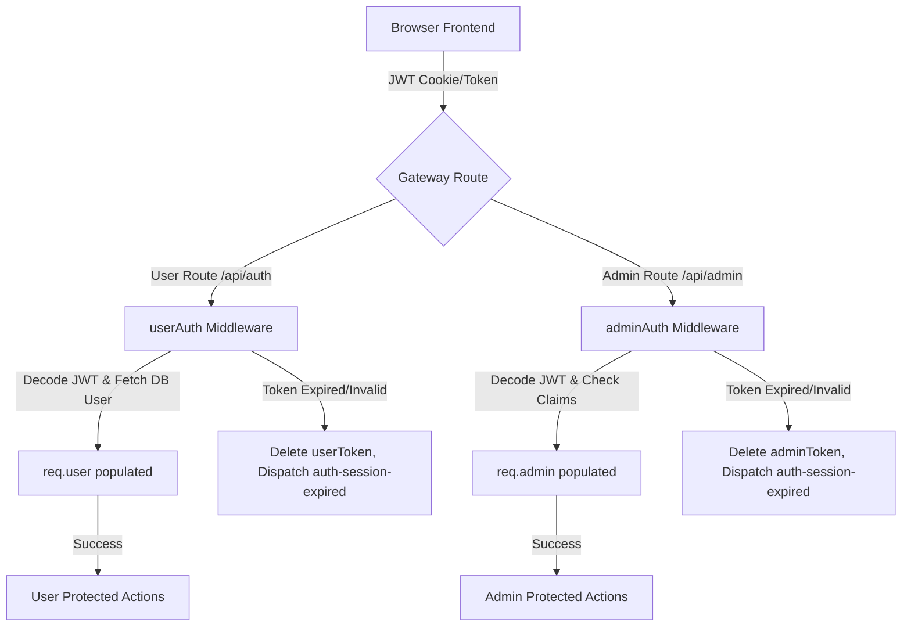

# BRAIN.md - Project Living Memory & System Architecture

This living document contains the complete structural blueprints, schema details, security decisions, features, and coding guidelines for the FloraCraft application. It acts as the persistent context ledger to prevent context loss for future developers and AI assistants.

---

## Project Overview

*   **Project Name:** FloraCraft (aka LeafLoft)
*   **Purpose:** A premium, production-ready MERN-stack e-commerce catalog and ordering platform specialized in air-purifying, indoor, and outdoor house plants.
*   **Current Version:** 2.0.0
*   **Tech Stack:**
    *   **Backend:** Node.js, Express, MongoDB (via Mongoose), JSON Web Tokens (JWT), BcryptJS, Helmet, Express-Rate-Limit, Express-Validator.
    *   **Frontend:** React (hooks, contexts), React Router DOM (v6), Vite (bundler), Vanilla CSS (custom Lukani-inspired variables).
*   **Architecture:** Modular Monorepo containing isolated `backend` and `frontend` folders. APIs follow REST conventions, while the frontend utilizes central React context providers for state sync, alerts, and authentication.

### Folder Structure

```
leafLoft/
├── backend/
│   ├── src/
│   │   ├── config/             # Environment & service configurations
│   │   ├── controllers/        # Request handlers (logical division)
│   │   ├── middleware/         # Security, rate limiters, error catchers
│   │   │   ├── adminAuth.js    # Decodes admin JWT tokens
│   │   │   ├── userAuth.js     # Decodes customer JWT tokens & loads user
│   │   │   └── rateLimiter.js  # Brute-force & API protection
│   │   ├── models/             # Mongoose Schemas (Plant, User, Cart, Order)
│   │   ├── routes/             # Express API Routers
│   │   │   ├── admin.js        # Analytics & CRUD management
│   │   │   ├── plants.js       # Catalog, details, and review routes
│   │   │   ├── userAuth.js     # Customer auth, profile, addresses, wishlist
│   │   │   ├── cart.js         # Persistent shopping cart routes
│   │   │   └── orders.js       # Checkouts, order cancellations, mock payment
│   │   ├── seed/               # Initial database seed assets & script
│   │   ├── db.js               # Database connection helper
│   │   └── index.js            # Express server entry point & startup validation
│   ├── .env.example            # Environment variables template
│   ├── package.json            # Node backend configuration
│   └── README.md               # Backend readme
├── frontend/
│   ├── src/
│   │   ├── assets/             # Images & static assets
│   │   ├── components/         # Shared UI Components (cards, grids, loaders, form)
│   │   ├── context/            # React context providers
│   │   │   ├── AppContext.jsx  # Customer session, admin claims, and cart status
│   │   │   └── ToastContext.jsx# Global animated alert system
│   │   ├── pages/              # Routing pages (Home, Store, Details, Cart, Profile, Checkout, Admin)
│   │   ├── api.js              # Fetch client wrapper with token expiry & role handling
│   │   ├── main.jsx            # React client mount root
│   │   └── styles.css          # Core CSS variables, classes, and micro-animations
│   ├── index.html              # HTML shell template
│   ├── package.json            # Vite React dependencies configuration
│   └── vite.config.js          # Vite compilation settings
└── BRAIN.md                    # System architecture & AI instructions (This file)
```

---

## Feature Inventory

### 1. Customer Authentication & Registration
*   **Purpose:** Allows shopping customers to register, login, track order history, save addresses, and write reviews. Fully isolated from admin access.
*   **Backend Files:** `userAuth.js` (router), `userAuth.js` (middleware), `User.js` (model).
*   **Frontend Files:** `Login.jsx` (auth card toggler), `api.js` (calls), `AppContext.jsx` (session holder).
*   **API Routes:**
    *   `POST /api/auth/register`: Creates hashed account & returns JWT.
    *   `POST /api/auth/login`: Verifies user & returns JWT.
    *   `GET /api/auth/verify`: Verifies customer token status on mount.
    *   `GET /api/auth/me`: Loads profile details.
*   **Security:** Password hashed using `bcryptjs` (10 rounds); tokens signed with `"HS256"` algorithm expiring in 2 hours; rate limited to 5 attempts per 15 minutes per IP.

### 2. Address Management & GPS Geolocation
*   **Purpose:** Supports saving multiple delivery destinations with interactive coordinates-to-address lookup.
*   **Backend Files:** `userAuth.js` (CRUD routes nested inside auth router), `User.js` (addresses subdocument array).
*   **Frontend Files:** `Profile.jsx` (address dashboard tab), `api.js` (calls).
*   **API Routes:**
    *   `GET /api/auth/addresses`: Returns saved addresses.
    *   `POST /api/auth/addresses`: Adds address.
    *   `PUT /api/auth/addresses/:id`: Edits address.
    *   `DELETE /api/auth/addresses/:id`: Deletes address.
    *   `PUT /api/auth/addresses/:id/default`: Toggles default address.
*   **Browser Geolocation:** Clicking "Auto-Detect Location" queries the browser Geolocation API. Coords are sent to the open-source OpenStreetMap Nominatim reverse-API (`https://nominatim.openstreetmap.org/reverse`) to automatically prefill address forms. If permission is denied or fails, switches to manual input.

### 3. Database-Backed Persistent Cart
*   **Purpose:** Keeps a customer's cart synced to their database profile across devices. Guests are blocked and prompted to log in before adding items.
*   **Backend Files:** `cart.js` (router), `Cart.js` (model), `userAuth.js` (middleware check).
*   **Frontend Files:** `Cart.jsx` (quantities UI), `ProductDetails.jsx` (add to cart trigger), `api.js` (calls).
*   **API Routes:**
    *   `GET /api/cart`: Returns user cart.
    *   `POST /api/cart/add`: Inserts item (verifies stock).
    *   `POST /api/cart/update-quantity`: Edits item quantity (verifies stock).
    *   `POST /api/cart/remove`: Removes item.
    *   `POST /api/cart/clear`: Resets items list.
*   **Security & Rules:** Performs server-side stock comparison at insert/update. Blocks quantities exceeding plant stock.

### 4. Plant Catalog, Details & Customer Reviews
*   **Purpose:** Allows searching/filtering the inventory, viewing image carousels, and managing product reviews.
*   **Backend Files:** `plants.js` (router), `Plant.js` (model).
*   **Frontend Files:** `Store.jsx` (catalog grid), `ProductDetails.jsx` (product gallery and reviews form), `api.js` (calls).
*   **API Routes:**
    *   `GET /api/plants`: Paginated, searchable, sorted listings.
    *   `GET /api/plants/:id`: Returns single plant details.
    *   `POST /api/plants/:id/reviews`: Inserts/updates user's review & recalculates average ratings.
    *   `DELETE /api/plants/:id/reviews/:reviewId`: Removes user's review & recalculates average ratings.
*   **Validation:** Review additions enforce integer ratings (1-5) and non-empty comment texts.

### 5. Multi-Step Checkout & Mock Payment
*   **Purpose:** Validates cart contents,Shipping details, and handles Cash on Delivery or simulated Online payment transactions.
*   **Backend Files:** `orders.js` (router), `Order.js` (model), `Cart.js` (cleared on success), `Plant.js` (adjusts stock).
*   **Frontend Files:** `Checkout.jsx` (step wizard), `api.js` (calls).
*   **API Routes:**
    *   `POST /api/orders/checkout`: Deducts stock, calculates totals, clears cart, and creates order.
    *   `GET /api/orders`: Order history.
    *   `GET /api/orders/:id`: Specific order details.
    *   `POST /api/orders/:id/cancel`: Cancels pending orders and restores product stock.
*   **Mock Payments:**
    *   *COD:* paymentStatus is set to 'Pending'; transactionId is empty.
    *   *Online Payment:* Simulates loading states, requires card inputs, creates unique `TXN-` code, and sets status to 'Paid'.

### 6. Extended Admin Console
*   **Purpose:** Restricts administration metrics and CRUD catalog updates to authenticated administrators.
*   **Backend Files:** `admin.js` (router), `adminAuth.js` (middleware), `plants.js` (post route).
*   **Frontend Files:** `Admin.jsx` (dashboard tabs), `api.js` (calls).
*   **API Routes:**
    *   `POST /api/plants`: Creates product.
    *   `GET /api/admin/stats`: Summarizes total products, orders, users, and cumulative revenue.
    *   `GET /api/admin/orders`: Platform-wide orders lists.
    *   `PUT /api/admin/orders/:id/status`: Updates shipping stage (Pending, Processing, Shipped, Delivered, Cancelled) and payment status (Pending, Paid, Failed).
    *   `GET /api/admin/users`: User registry list.
    *   `PUT /api/admin/plants/:id`: Edits plant detail.
    *   `DELETE /api/admin/plants/:id`: Deletes plant.
*   **Obscurity Security:** Header/footer admin portal navigation links are completely hidden for Shoppers. Direct navigation to `/admin` forces the admin gatekeeper login screen, checking against env configurations.

---

## Database Schema blue-prints

### 1. Plants Collection (`Plant.js`)
```javascript
{
  name: { type: String, required: true, index: true },
  price: { type: Number, required: true, min: 0 },
  categories: { type: [String], index: true, default: [] },
  available: { type: Boolean, default: true },
  image: { type: String, default: "" },
  rating: { type: Number, min: 0, max: 5, default: 4.5 },
  description: { type: String, default: "" },
  images: { type: [String], default: [] }, // Additional carousel images
  stock: { type: Number, default: 15, min: 0 },
  reviews: [
    {
      user: { type: ObjectId, ref: "User", required: true },
      userName: { type: String, required: true },
      rating: { type: Number, required: true, min: 1, max: 5 },
      comment: { type: String, required: true },
      createdAt: { type: Date, default: Date.now }
    }
  ]
}
// Indexes: { name: "text", categories: "text" } for global catalog searches.
```

### 2. Users Collection (`User.js`)
```javascript
{
  name: { type: String, required: true, trim: true },
  email: { type: String, required: true, unique: true, lowercase: true, trim: true, index: true },
  password: { type: String, required: true },
  phoneNumber: { type: String, default: "", trim: true },
  profileImage: { type: String, default: "" },
  addresses: [
    {
      fullName: { type: String, required: true },
      phoneNumber: { type: String, required: true },
      houseNumber: { type: String, required: true },
      street: { type: String, required: true },
      landmark: { type: String, default: "" },
      city: { type: String, required: true },
      state: { type: String, required: true },
      country: { type: String, required: true },
      pincode: { type: String, required: true },
      isDefault: { type: Boolean, default: false }
    }
  ],
  wishlist: [{ type: ObjectId, ref: "Plant" }]
}
```

### 3. Carts Collection (`Cart.js`)
```javascript
{
  user: { type: ObjectId, ref: "User", required: true, unique: true, index: true },
  items: [
    {
      product: { type: ObjectId, ref: "Plant", required: true },
      quantity: { type: Number, required: true, min: 1, default: 1 }
    }
  ]
}
```

### 4. Orders Collection (`Order.js`)
```javascript
{
  user: { type: ObjectId, ref: "User", required: true, index: true },
  products: [
    {
      product: { type: ObjectId, ref: "Plant", required: true },
      name: { type: String, required: true },
      price: { type: Number, required: true },
      quantity: { type: Number, required: true },
      image: { type: String, default: "" }
    }
  ],
  shippingAddress: {
    fullName: String,
    phoneNumber: String,
    houseNumber: String,
    street: String,
    landmark: String,
    city: String,
    state: String,
    country: String,
    pincode: String
  },
  paymentMethod: { type: String, enum: ["COD", "Online"], required: true },
  paymentStatus: { type: String, enum: ["Pending", "Paid", "Failed"], default: "Pending" },
  orderStatus: { type: String, enum: ["Pending", "Processing", "Shipped", "Delivered", "Cancelled"], default: "Pending", index: true },
  transactionId: { type: String, default: "" },
  totalAmount: { type: Number, required: true, min: 0 }
}
```

---

## Authentication & JWT Lifecycle

### Flow Diagram (Isolated Roles)



### Key Security Decisions
*   **Isolated Sessions:** Admin claims and Customer accounts have distinct lifecycles. Customer records reside in database (`User`), while Admin uses environment configuration verification.
*   **HS256 Enforcements:** Standard signature validation options are restricted:
    *   Sign: `jwt.sign(payload, secret, { algorithm: "HS256", expiresIn: "2h" })`
    *   Verify: `jwt.verify(token, secret, { algorithms: ["HS256"] })`
*   **Authentication Errors:** Authentication endpoints return a generic `"Invalid username or password"` on login credentials failure. This blocks brute-force enumeration attacks by hiding whether the username or password was incorrect.
*   **JWT Storage:** JWT is saved in `localStorage`. In high-security production environments over HTTPS, it should be changed to a `Secure`, `HttpOnly` cookie to protect against token theft via XSS.

---

## Security Framework

*   **Helmet:** Implemented in `index.js` to block cross-site scripting (XSS), sniffing attacks, and configure clickjacking protections.
*   **CORS Hardening:** Production environment strictly matches `process.env.FRONTEND_URL` and rejects wildcard origin headers.
*   **Brute-Force Protection:** Rate limiting prevents route exhaustion:
    *   *Login attempts:* Locked to 5 requests per 15 minutes.
    *   *API queries:* Locked to 100 requests per 15 minutes.
*   **Input Sanitization & Injection Defense:** `express-validator` validates fields (lengths, email patterns, type matching) and sanitizes/trims values before processing database operations.
*   **Security Logging:** Actions (successful logins, failed attempts, and plant catalog creation/updates/deletions) write alerts to the server console. Passwords and secrets are never logged.

---

## Design Decisions & Trade-offs

*   **LocalStorage vs. Cookies for JWT:**
    *   *Decision:* LocalStorage was chosen for the demo implementation to simplify cross-origin development (e.g. backend on Render, frontend on Vercel) without complex cross-site cookie configurations.
    *   *Trade-off:* LocalStorage leaves the app vulnerable to XSS token theft. Code comments advise migrating to secure HttpOnly cookies for production staging.
*   **Admin environment configuration vs. Database User Roles:**
    *   *Decision:* Admin credentials are configured directly in environment variables (`ADMIN_USERNAME` and `ADMIN_PASSWORD_HASH`).
    *   *Alternative Rejected:* Having user roles (e.g., `role: 'admin'`) in the main user database table was rejected to ensure absolute isolation between customer registration databases and admin controls, avoiding escalation vulnerabilities.
*   **GPS Reverse Geocoding Provider:**
    *   *Decision:* Nominatim OpenStreetMap API was utilized.
    *   *Alternative Rejected:* Google Places API was rejected because Nominatim is open-source, free, requires no API credentials setup, and satisfies the geolocation mapping requirement without maintenance costs.

---

## Current Limitations & Technical Debt

*   **Offline/Mock Payments:** Checkout relies on mock simulation. The backend schemas, however, are pre-configured to easily link Razorpay/Stripe payload decoders inside `orders.js` in the future.
*   **State Management:** Large client state (user session, cart sync) resides in simple React Contexts. While suitable for a medium catalog, highly complex apps could migrate this to Redux Toolkit or Zustand.
*   **Bcrypt local compile warnings:** `bcryptjs` is utilized instead of native `bcrypt` to prevent local compilation issues across different operating systems (such as node-gyp build failures on Windows environment platforms).

---

## AI Coding Instructions & Rules

> [!IMPORTANT]
> All AI coding assistants modifying this repository MUST strictly follow these rules:

1.  **Do Not Rebuild Architecture:** Never change the directory structure, routing systems, or framework choices unless explicitly requested. Extend existing logic.
2.  **Preserve UI Design System:** Maintain the olive green, organic Lukani design language (`--accent: #78a206;`, Playfair Display font, rounded borders, clean badge states, card shadows, and transition animations).
3.  **No Ad-Hoc Utilities:** Add custom styling rules to `frontend/src/styles.css` instead of writing inline stylesheet properties inside React files. Use camelCase keys in style objects (e.g. `objectFit` instead of `object-fit`).
4.  **Backend Validation Guard:** Always validate inputs using `express-validator` on the server. Never trust client validation alone.
5.  **Always Update `BRAIN.md`:** If you add a route, modify a model schema, or introduce a dependency, you **MUST** update this memory ledger immediately before closing the task.

---

## Quick Reference Sheet

### Env Configuration Setup
```env
PORT=4000
MONGO_URI=mongodb://localhost:27017/floracraft_plants
NODE_ENV=development
ADMIN_USERNAME=admin
ADMIN_PASSWORD_HASH=$2a$10$lQeHjQjSgL0dI/YjC/7J1O.b/4U5Lw2vD0F6471V0lQv1wS4gT2.C
JWT_SECRET=floracraft_jwt_secret_token_key_development_only_123
FRONTEND_URL=http://localhost:5173
```
*Create cryptographically secure secrets via: `node -e "console.log(require('crypto').randomBytes(32).toString('hex'))"`*

### Core Routes Registry
| Method | Endpoint | Protection | Purpose |
| :--- | :--- | :--- | :--- |
| **POST** | `/api/auth/register` | Public (Rate Limited) | Registers customer user |
| **POST** | `/api/auth/login` | Public (Rate Limited) | Verifies credentials (User/Admin) |
| **GET** | `/api/auth/verify` | Public | Decodes and validates active JWTs |
| **PUT** | `/api/auth/profile` | Customer (`userAuth`) | Edits profile details |
| **POST** | `/api/auth/addresses` | Customer (`userAuth`) | Inserts new delivery address |
| **POST** | `/api/cart/add` | Customer (`userAuth`) | Inserts plant, checks stock |
| **POST** | `/api/orders/checkout` | Customer (`userAuth`) | Checks stock, places order, clears cart |
| **POST** | `/api/plants` | Admin (`adminAuth`) | Creates catalog entry |
| **GET** | `/api/admin/stats` | Admin (`adminAuth`) | Fetches total stats & revenue data |
| **PUT** | `/api/admin/orders/:id/status`| Admin (`adminAuth`) | Updates shipping/delivery stage |
